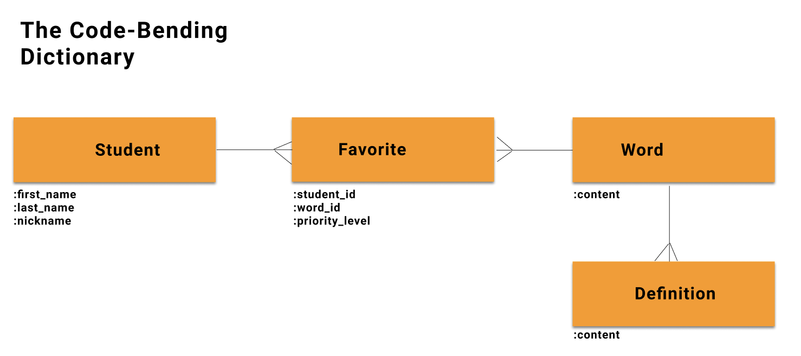

# Rest and Read in Rails

## Table of contents
- [Mod2 what we will be building 🔧](#mod2-what-we-will-be-building)
- [Learning Goals 📚](#learning-goals)
- [Self-check after-lecture questions 🧐](#self-check-after-lecture-questions)
- [Review 📖](#review)
- [Outline 🗺](#outline)
- [Helpful Bookmarks 🤓](#helpful-bookmarks)
- [Rails folder structure 🏠](#rails-folder-structure)
- [Rails process 🌮](#rails-process)
- [Rails Commands Reference 👾](#rails-commands-reference)

--- 

## Mod2: what we will be building
In this mod we will be building a helpful resource for all Code Benders and their friends: a dictionary of confusing tech terms. You are all invited to join in -- initially by submitting definitions or words, and afterwards, as contributors to this open source project.

We will add to this app every lecture, step by step, and we will come back to it again in Mod3.

---
 
## Learning Goals
* Create a new Rails application
* Generate a model
* Create routes
* Generate a controller
* Create actions/methods for a RESTful controller
* Create views

---

## Self-check after-lecture questions
Please read these questions carefully **before** the lecture so that you will know what to pay attention to **during** the lecture.

1. How does an angry squid and ice cream relate to Rails?
2. What’s the `byebug` and where can I play with it?
3. What are the steps involved in starting a Rails project from scratch?
4. What do `rails g migration`, `rails g model`, `rails g controller` methods do? Can I reverse them?!
5. What are a `show` and an `index` action for?
6. How does Rails know what controller to use when I type `localhost:3000/students`?
7. What are and where are params coming from?
8. What is dynamic routing and why is it awesome?
9. How can I bring information from a database to the views?
10. Of what instance are the instance variables used in controllers?
11. What is Rails tool for generating `<a href>` tags that know about our database?

--- 

## Outline
* [ ] Review terms we will be using
* [ ] Create a new Rails app
* [ ] Generate a model
* [ ] Create controller, routes, and views
  * [ ] Make route and controller action for `index` and `show` with custom routes
  * [ ] Demonstrate implicit rendering
* [ ] Demonstrate `link_to` helper and path helpers
  * [ ] `rails routes` and `/rails/info/routes`

---

## Review
* What is a request? Who sends it?
    *  Client sends a requests to get information to/from the server
* What is a response? Who sends it?
    *  What server sends back to the user (client) after it processes the data
* What is an ice-cream cone and an angry squid?
    * ERB: an 'embedded ruby' file that will dynamically output pure rendering of HTML inside the file; it is a way for ruby to written in “HTML” 
    * `<% %>`: Ice cream code evaluates ruby code but does not print
    * `<%= %>`: Angry squid does both
* What is a route?
    * A route is a path that allows you access a page of your preference; it connects with an appropriate method and renders an appropriate view
* What is a controller?
    * A controller is the waiter; between the model and the view. Determines what the user will be doing/seeing based on the request
* What is a view?
    *  The HTML files (what is displayed on the browser)
* What is MVC?
    *   Model-View-Controller, its a design pattern for building web applications  (chef, waiter, serving/dining table)

---

## Helpful Bookmarks

* [Rails Routing from the Outside In](https://guides.rubyonrails.org/routing.html)
* [link_to](https://apidock.com/rails/ActionView/Helpers/UrlHelper/link_to)
* [Rails generators](https://guides.rubyonrails.org/command_line.html#rails-generate)
* [ERB cheat sheet](https://medium.com/swlh/cheatsheet-which-erb-tag-should-i-use-4b3de261f15f)
* [Creating your own Rails generator](https://guides.rubyonrails.org/generators.html)

---

## Rails folder structure
`rails new` generates a lot of files. It may feel overwhelming. Good news for you is that you won't be touching majority of these files. Here's a guide of what you need to become familiar with and where to find it (ordered from the bottom to the top):
- `Gemfile` -- a file responsible for gems; it's located in the "root" directory (not in any folder)
- `Readme` -- a documentation of your project; it's located in the "root" directory (not in any folder)
- `db` -- database folder (e.g. seeds, migrations, schema)
- `config/routes` -- a file dedicated to creating routes
- `app/views` -- a folder where you'll place all the **folders** for each of the model to store ERB files (named accordingly to the methods in controller) and `layouts` (default styling, we will talk about it next week)
- `app/controllers` -- a folder where you'll place all your controllers
- `app/models` -- a folder where you'll place all your models
- `app/assets` -- this is where you'd place css stylesheets (we will talk about it twice in weeks 2 and 3)

--- 

## Rails process
1. `rails new` (or `git clone` and `bundle install`)
2. `rails g model`, `rails db:migrate`
3. fill out models, fill out seeds
4. `rails db:seed`
5. routes
6. controllers
7. views
8. `rails s` and test it manually ✨

---

## Rails Commands Reference
* `rails new <app-name>` - create a new Rails app
* `rails c` - open a console
* `rails s` - start server
* `rails g migration <migration-name> <attribute:data-type> <attribute:data-type>` - generate a migration
* `rails g model <model-name> <attribute:data-type> <attribute:data-type>` - generate a model and a migration to create the table with specified columns
* `rails g controller <model-name-pluralized>` - generate a controller
* `rails routes` - display all the routes in your app, also can viewed at http://localhost:3000/rails/info/routes
* `rails db:migrate` - run all pending migrations (same as `rake db:migrate` in Mod 1)